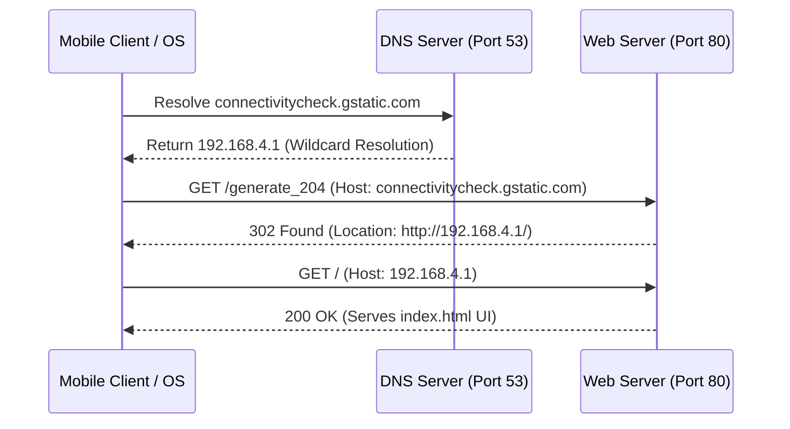

# Haxel Custom Network & Captive Portal Setup

This document details the configuration for Haxel's offline wireless networking, captive portal redirection, and passwordless open Access Point (AP) setup.

---

## 1. Unique SSID Generation (MAC-based Suffix)
To prevent SSID conflicts when flashing and running multiple ESP32 boards concurrently, the Access Point name is dynamically generated on boot.

- **Implementation**: Located in `generateApSsid_()` in [Config.cpp](file:///f:/Github/Website/public/ESP32Codes/PlatformIO/Haptic/Haxel/firmware/src/core/Config.cpp#L35-41):
  ```cpp
  String Config::generateApSsid_() {
      uint64_t mac = ESP.getEfuseMac();
      char buf[32];
      snprintf(buf, sizeof(buf), "Haxel-%04X",
               (uint16_t)((mac >> 32) & 0xFFFF));
      return String(buf);
  }
  ```
- **How it works**: It reads the ESP32's unique 48-bit MAC address from hardware eFuses via `ESP.getEfuseMac()`, extracts the final 4 hexadecimal characters, and appends them to the SSID (e.g. `Haxel-3CE7`). This allows you to flash dozens of boards without confusing which board you are connecting to.

---

## 2. Passwordless Open Access Point Setup
Setting up a password-free AP is crucial for consumer ease of use and instant connectivity when offline.

- **Passwordless Open Network**: In [main.cpp](file:///f:/Github/Website/public/ESP32Codes/PlatformIO/Haptic/Haxel/firmware/src/main.cpp#L105-112), we call the `WiFi.softAP()` method *without* passing a password argument:
  ```cpp
  WiFi.softAP(gConfig.apSsid().c_str());
  ```
  Leaving the second parameter empty causes the ESP32 framework to start a completely open AP, allowing clients to connect without being prompted for a password.
- **Tx Power Configuration**: Before starting the AP, we set the maximum Wi-Fi transmission power to ensure the signal remains strong and easily discoverable by client devices:
  ```cpp
  WiFi.setTxPower(WIFI_POWER_19_5dBm);
  ```

---

## 3. Captive Portal Redirection Architecture
Operating systems probe online checks upon connecting to any wireless network. To trigger the OS's native "Sign-in to network" login window automatically, we catch these queries and redirect them locally.



### Components

#### A. Wildcard DNS Server (Port 53)
- An instance of `DNSServer` runs in a housekeeping task.
- It is configured with `"*"` wildcard matching, meaning **any** DNS request (e.g., `apple.com`, `google.com`, `connectivitycheck.gstatic.com`) is resolved to the ESP32's local AP IP address: `192.168.4.1`.
- **Implementation** in [CaptivePortal.cpp](file:///f:/Github/Website/public/ESP32Codes/PlatformIO/Haptic/Haxel/firmware/src/web/CaptivePortal.cpp#L6-11):
  ```cpp
  dns_.setErrorReplyCode(DNSReplyCode::NoError);
  dns_.start(53, "*", apIp);
  ```

#### B. Redirection Request Handler (Port 80)
- In [WebServer.cpp](file:///f:/Github/Website/public/ESP32Codes/PlatformIO/Haptic/Haxel/firmware/src/web/WebServer.cpp#L12-40), we register a custom `CaptiveRequestHandler` as the **very first handler** in the routing chain.
- If the incoming request has a Host header that is not `192.168.4.1` or `*.local`, `canHandle()` returns `true` to intercept it.
- The handler returns a `302 Found` status redirecting the user to `http://192.168.4.1/`, alongside strict `no-cache` headers so the browser does not attempt to cache the redirection.
  ```cpp
  void handleRequest(AsyncWebServerRequest *request) override {
      AsyncWebServerResponse *response = request->beginResponse(302, "text/plain", "");
      response->addHeader("Location", "http://192.168.4.1/");
      response->addHeader("Cache-Control", "no-cache, no-store, must-revalidate");
      response->addHeader("Pragma", "no-cache");
      response->addHeader("Expires", "-1");
      request->send(response);
  }
  ```
- Any request that actually uses `192.168.4.1` as the host bypasses this redirect handler and falls through to the static file server to show the web interface.
