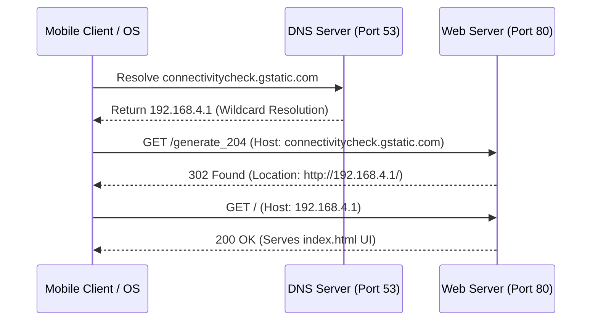

# Haxel — Agent / Maintainer Guide

Haxel turns an ESP32 + motor driver into a programmable haptic engine with a web UI (WiFi captive portal) or Chrome Web Bluetooth (BLE builds).

**Paths (current tree):**
- Firmware: `PlatformIO/02_Audio_Haptics/Haxel/firmware/`
- Hosted portals: `public/Projects/Haxel/` (`index.html` WiFi docs, `bluetooth.html` BLE)
- Flasher: `public/ESP32Codes/_tooling/uploader/`

For product vision and older phased specs see sibling `*_SPEC.md` / `ROADMAP.md`. Prefer this file + `firmware/` when behavior disagrees with outdated specs.

---

## Flash

### Web Uploader (preferred)

1. `firmware/upload.bat` → opens `_tooling/uploader/start-uploader.bat`
2. Browser **http://localhost:3567**
3. Project **Haxel/firmware**, pick ENV + COM port → **BUILD & FLASH DEVICE**  
   (runs `upload` then `uploadfs` when LittleFS is configured)

Details: [`_tooling/uploader/README.md`](../../../_tooling/uploader/README.md)

### Manual PlatformIO

```bat
cd firmware
pio run -e c3WIFILED -t upload
pio run -e c3WIFILED -t uploadfs
pio device monitor
```

ESP32-C3 download mode if needed: hold BOOT → pulse RESET → release BOOT.

---

## Modular builds (`platformio.ini`)

Naming: `<board><TRANSPORT>[FEATURES…]`. Default env: **`c3WIFILED`**.

| Env | Transport | Features |
|-----|-----------|----------|
| `c3WIFI` | WiFi | Minimal |
| `c3WIFILED` | WiFi | FastLED |
| `c3WIFIAUDIOLED` | WiFi | LED + I2S/ADC FFT |
| `c3BLULED` | BLE | FastLED (standalone; not fleet) |
| `c3WIFILED_MASTER` | WiFi SoftAP + ESP-NOW | Command Mode Master, LED, Audio |
| `c3WIFILED_FOLLOWER` | ESP-NOW | Command Mode Follower, LED (no portal) |
| `c6WIFILED_FOLLOWER` | ESP-NOW | **FireBeetle C6** fleet follower, **L298N** 2-ch (3 motors) |
| `c6BLULED` | BLE | **FireBeetle C6** standalone BLE (motor pins 16/17/19/20) |
| `c6WIFILED` | WiFi | **FireBeetle C6** portal + strip (bench) |
| `c3FULLOLED` | WiFi | LED + Audio + Knobs + OLED |
| `s3WIFILED` / `s3BLULED` | WiFi/BLE | S3 equivalents |
| `devWIFILED` / `devBLULED` | WiFi/BLE | Classic ESP32 |

Legacy aliases (`esp32-c3-wifi`, `esp32-c3-ble`, …) still extend the modular envs.

**Flags:** `HAXEL_WIFI` *or* `HAXEL_BLU` (mutually exclusive compile). Features: `HAXEL_FEATURE_LED/AUDIO/KNOBS/OLED/MESH_MASTER/MESH_FOLLOWER`.

**Important:** BLE envs must **not** pull AsyncWebServer. Shared JSON helpers live in `web/StateApi.*`. WiFi-only sources (`WebServer`, `CaptivePortal`, `ApiHandlers`) are `#ifdef HAXEL_WIFI` and excluded via `build_src_filter` on BLE envs. Mesh sources live in `firmware/src/mesh/` and are excluded from non-mesh envs.

---

## Command Mode (Master + ESP-NOW Fleet)

Fixed-role multi-unit control. The Master's SoftAP portal commands up to ~10 Followers over ESP-NOW. Standalone BLE Haxels (`c3BLULED`) stay outside the fleet.

Flash via [`_tooling/uploader`](../../../_tooling/uploader/README.md) (ENV dropdown shows flag labels like `c3WIFILED_MASTER — WiFi · LED · Audio · Mesh Master`) or:

```bat
pio run -e c3WIFILED_MASTER -t upload
pio run -e c3WIFILED_MASTER -t uploadfs
pio run -e c3WIFILED_FOLLOWER -t upload
pio run -e c6WIFILED_FOLLOWER -t upload
```

**FireBeetle 2 ESP32-C6 Mini (22× fleet):** use **`c6WIFILED_FOLLOWER`** — **mini L298N** on GPIO **16/17/19/20**, coin motors in parallel on MOTOR-A, M1N10 on MOTOR-B. Pin map: [`firmware/PinOut_C6_FireBeetle.md`](firmware/PinOut_C6_FireBeetle.md). Later standalone BLE: **`c6BLULED`**.

- **Master:** SoftAP locked to Wi-Fi channel 1, captive portal **Fleet** tab, `/json/fleet` API, broadcasts `STATE`/`AUDIO`/`ESTOP`, claims HELLO advertisers.
- **Follower:** no SoftAP UI; public HELLO until claimed; link-loss failsafe (~200 ms) stops motors; remote `AudioFrame` feeds audio-reactive patterns.
- **Protocol:** compact binary in `mesh/MeshProtocol.h` (not JSON over ESP-NOW). Config epochs via unicast `CONFIG_CHUNK` / `CONFIG_ACK`.
- Connect phone to Master SSID → Fleet tab shows cards, waveforms, claim/release, group play/stop/E-Stop.

---

## Runtime overview

- **Engine** (~1 kHz FreeRTOS task): pattern → duty; LEDs use pre-floor pattern amp (`getPatternValue()`), not motor startup floor. Followers may inject mesh audio via `Engine::pushRemoteAudio()`.
- **HAL:** `IHapticDriver` + factory (MOSFET PWM, DRV2605L, etc.).
- **WiFi:** open AP `Haxel-XXXX` (MAC suffix), captive DNS → `192.168.4.1`, LittleFS UI in `firmware/data/`.
- **BLE:** GATT device uses the same `Haxel-XXXX` name as the SoftAP SSID; control from `Projects/Haxel/bluetooth.html` (**CONNECT BLE** in Chrome/Edge). Hosted BLE page loads `bluetooth.js` (safe `sync-request` hydration).
- **Patterns:** registry in firmware; IDs sync with `data/haptics.js` and hosted `Projects/Haxel/haptics.js`.

---

## Captive portal (WiFi)

### Unique SSID (MAC suffix)

`Config::generateApSsid_()` reads `ESP.getEfuseMac()` and builds `Haxel-%04X` so multiple boards do not collide.

### Open AP

`WiFi.softAP(ssid)` with no password → open network. Tx power set high for discoverability before `softAP`.

### Captive redirect


```mermaid
sequenceDiagram
    participant Client as Mobile Client / OS
    participant DNS as DNS Server (Port 53)
    participant Web as Web Server (Port 80)

    Client->>DNS: Resolve connectivitycheck.gstatic.com
    DNS-->>Client: Return 192.168.4.1 (Wildcard Resolution)
    Client->>Web: GET /generate_204 (Host: connectivitycheck.gstatic.com)
    Web-->>Client: 302 Found (Location: http://192.168.4.1/)
    Client->>Web: GET / (Host: 192.168.4.1)
    Web-->>Client: 200 OK (Serves index.html UI)
```

- DNS: `DNSServer` wildcard `*` → AP IP.
- HTTP: first handler redirects foreign `Host` headers to `http://192.168.4.1/` with no-cache headers; requests already aimed at the AP IP serve LittleFS.

Implementation: `firmware/src/web/CaptivePortal.cpp`, `WebServer.cpp`, `Config.cpp`.

---

## UI sync notes

- **Source of truth (WiFi portal behavior):** `firmware/data/` — edit there first, then sync shared assets into `public/Projects/Haxel/` (`main.js`, `haptics.js`, `compiler.js`, `emulator.js`, `manual.html` as needed). Hosted `index.html` / `bluetooth.html` keep their docs/hero chrome; portal control logic follows firmware.
- On-device WiFi portal: `firmware/data/` (must `uploadfs` after UI edits).
- Hosted WiFi/BLE pages: `public/Projects/Haxel/` (no reflash).
- BLE and WiFi SoftAP share the same `Haxel-XXXX` identity (`Config::apSsid()`).
- Device menu can rename that shared identity; firmware normalizes it to a discoverable `Haxel...` name and applies it after save + reboot.
- Default driver is **MOSFET**; telemetry actuator type defaults to **ERM**.
- BLE page must keep `#bleConnectBtn` / `#bleConnectBtnDoc` for Web Bluetooth pairing.
- BLE control is read-only during connection: the portal sends `sync-request`, receives multipart config plus current state, hydrates all controls, and only then unlocks writes. Never send browser defaults during connect.
- BLE custom patterns use chunked `{type:"custom-pattern", seq, total}` (not legacy `savePattern`).
- Driver kind integers must match `hal::DriverKind` (`MOSFET=4`, `DRV2605L=3`, …).
