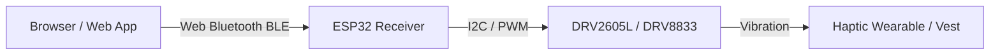

# Cochlear Emulator — Web Bluetooth Backend Plan

To enable real-world tactile testing, the three virtual actuator channels calculated in the **Hoxel Scripting Console** will be streamed wirelessly to physical haptic hardware (e.g., an ESP32 driving LRAs or solenoids) using the **Web Bluetooth API**.

---

## 1. System Architecture



### Protocol Details
- **Bluetooth Specification**: Bluetooth Low Energy (BLE).
- **Update Frequency**: 40–50 Hz (20–25ms intervals) to balance haptic temporal resolution with BLE connection intervals.
- **Service UUID**: A custom UMD Haptic Service UUID (e.g., `4a380001-c852-4fd3-bc42-f81df6fa3b82`).
- **Characteristic UUID**: An Actuator Write Characteristic UUID (e.g., `4a380002-c852-4fd3-bc42-f81df6fa3b82`) with `WRITE_WITHOUT_RESPONSE` properties enabled to reduce round-trip latency.

---

## 2. Low-Latency Packet Structure

To minimize overhead, the packet payload is restricted to **3 bytes** containing raw 8-bit intensity values:

| Byte Index | Channel | Target Hardware | Range |
| :---: | :--- | :--- | :---: |
| **0** | Actuator 0 | Bass (LRA) | `0` (Off) to `255` (Max) |
| **1** | Actuator 1 | Mid (LRA) | `0` (Off) to `255` (Max) |
| **2** | Actuator 2 | High (Solenoid) | `0` (Off) to `255` (Max) |

---

## 3. Web App Javascript API Stub

In the future iteration of [scripts.js](file:///F:/Github/Website/public/Projects/CochlearEmulator/scripts.js), we will add a connection panel to request the BLE device:

```javascript
let bleDevice = null;
let writeCharacteristic = null;

async function connectHapticBLE() {
    try {
        bleDevice = await navigator.bluetooth.requestDevice({
            filters: [{ namePrefix: 'UMD-Haxel' }],
            optionalServices: ['4a380001-c852-4fd3-bc42-f81df6fa3b82']
        });
        const server = await bleDevice.gatt.connect();
        const service = await server.getPrimaryService('4a380001-c852-4fd3-bc42-f81df6fa3b82');
        writeCharacteristic = await service.getCharacteristic('4a380002-c852-4fd3-bc42-f81df6fa3b82');
        console.log("BLE Actuator Connected.");
    } catch (err) {
        console.error("BLE Connection failed:", err);
    }
}

// Called in the animation tick loop at ~40Hz
function sendHapticBLEData() {
    if (writeCharacteristic && isProcessing) {
        const payload = new Uint8Array([
            Math.round(actuators[0] * 255),
            Math.round(actuators[1] * 255),
            Math.round(actuators[2] * 255)
        ]);
        writeCharacteristic.writeValueWithoutResponse(payload);
    }
}
```

---

## 4. Hardware Receiver (ESP32 Firmware)

The receiver firmware runs on an ESP32-C3 or ESP32-S3. It parses the incoming 3-byte packets inside a high-priority BLE callback task and updates the target PWM / I2C driver registers:

```cpp
class HapticCallbacks: public BLECharacteristicCallbacks {
    void onWrite(BLECharacteristic *pCharacteristic) {
        std::string rxValue = pCharacteristic->getValue();
        if (rxValue.length() == 3) {
            uint8_t act0 = rxValue[0];
            uint8_t act1 = rxValue[1];
            uint8_t act2 = rxValue[2];
            
            // Map values to drivers
            hapticEngine.updateActuator(0, act0);
            hapticEngine.updateActuator(1, act1);
            hapticEngine.updateActuator(2, act2);
        }
    }
};
```
