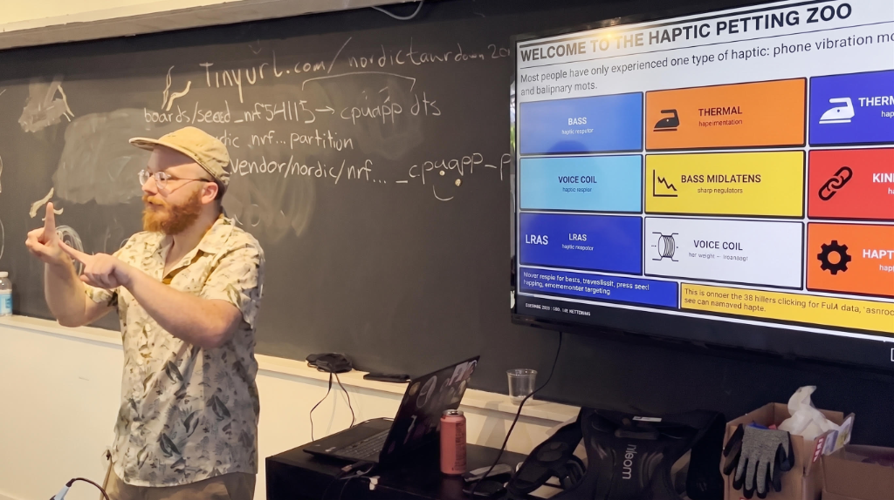
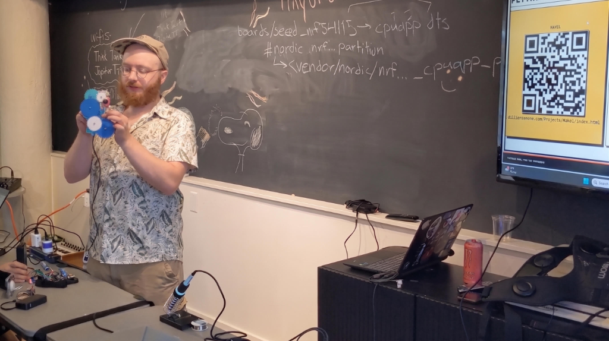
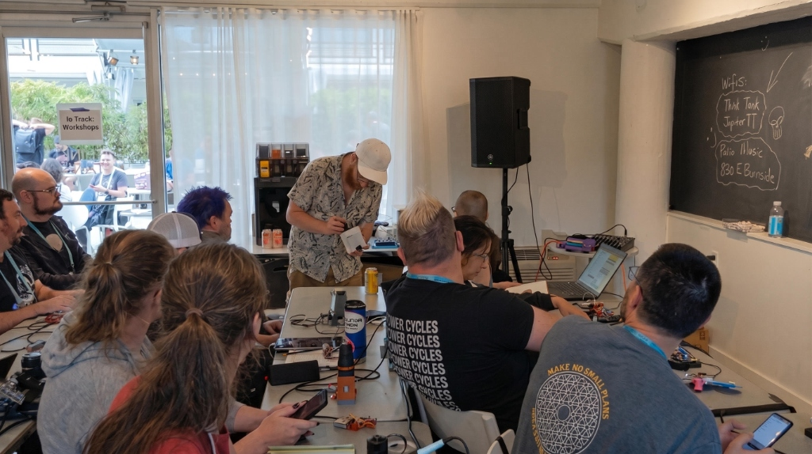
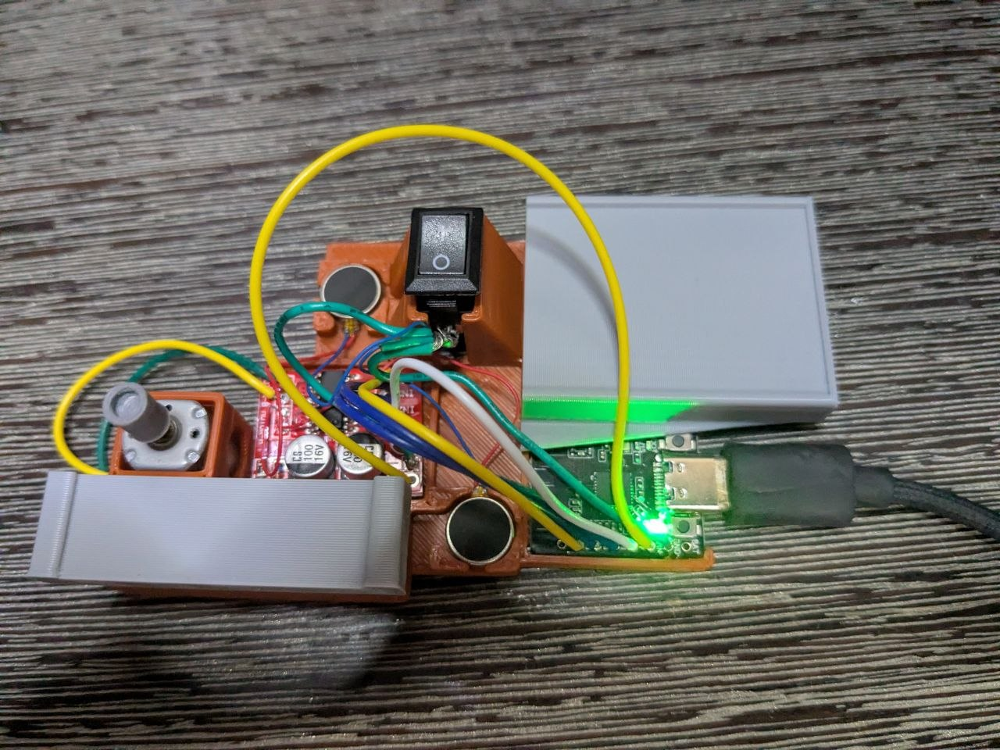
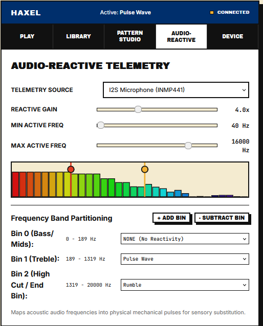

# ✦ Haptic Petting Zoo — Media & Press Asset Kit ✦

High-resolution photography, system architecture diagrams, and press assets for **The Haptic Petting Zoo** and **HAXEL** open-hardware tactile synthesis framework.

---

## 📸 Press & Workshop Photography

| Preview | Asset | Description |
| :--- | :--- | :--- |
|  | [`press-haptic-petting-zoo-presentation.png`](./press-haptic-petting-zoo-presentation.png) | **Live Presentation & ASL Demonstration** Dillon Simeone presenting the multi-modal haptic taxonomy (thermal, voice coil, LRA, bass transducers, kinetic) at Teardown 2026. |
|  | [`press-haptic-gear-mechanism-demo.png`](./press-haptic-gear-mechanism-demo.png) | **Kinesthetic & Mechanical Actuator Prototype** Demonstrating active 3D-printed gear detents and tactile feedback mechanisms alongside the HAXEL Web IDE. |
|  | [`press-hardware-assembly.jpg`](./press-hardware-assembly.jpg) | **Workbench Hardware Staging** Soldering and field-programming ESP32-C6 haptic drivers, power distribution, and multi-modal actuator nodes. |
|  | [`press-interactive-workshop-audience.jpg`](./press-interactive-workshop-audience.jpg) | **Community Hands-On Workshop** Participants experimenting with real-time sensory translation, tactile synthesis, and wearable haptic fixtures. |
|  | [`workshopKIT.jpg`](./workshopKIT.jpg) | **HAXEL Modular STEM Kit** Custom PCB haptic controllers and actuator breakout boards for educational workshops and classrooms. |
|  | [`18-signals-to-haptics-fft.png`](./18-signals-to-haptics-fft.png) | **Signal-to-Haptic DSP Architecture** Fast Fourier Transform (FFT) and frequency-band mapping diagram for real-time audio-to-tactile transduction. |

---

## 🚀 Key Links & Resources

* 🌐 **Live Web Experience**: [Haptic Petting Zoo Online Gazette](https://dillonsimeone.com/Projects/HapticPettingZoo/index.html)
* 🎛️ **Web IDE**: [HAXEL Live Web IDE](https://dillonsimeone.com/Projects/Haxel/index.html)
* 💻 **Firmware & Hardware Schematics**: [HAXEL ESP32 Source Tree](https://github.com/DillonSimeone/Website/tree/main/public/ESP32Codes/PlatformIO/02_Audio_Haptics/Haxel)
* 📜 **Talk Video**: [Watch "Feel the Difference: A Haptic Petting Zoo" on YouTube](https://youtu.be/QELd3fTHwCc)

---

## 📬 Media & Host Inquiries

For press interviews, high-resolution RAW photo files, or to schedule a stop on the 2026–2028 regional tour:
* **Contact**: [dillonsimeone@gmail.com](mailto:dillonsimeone@gmail.com)
* **Location**: Control+H Hackerspace / Portland, OR
