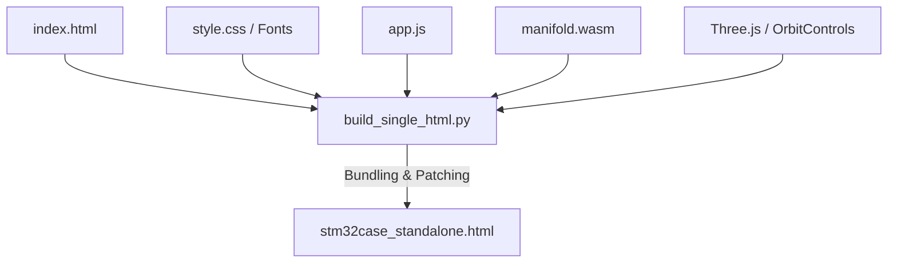

# Standing up a Fully Standalone 3D CAD Configurator (Offline Mode)

This document explains the packaging architecture and technical steps used to bundle the **STM32 Parametric Enclosure Configurator** (powered by **Three.js** and the WASM-based **Manifold 3D** geometry kernel) into a single, fully self-contained HTML file ([stm32case_standalone.html](file:///f:/Github/Website/public/ParametricModeling/09-STM32Case/stm32case_standalone.html)) that runs directly via the `file://` protocol.

---

## 🛑 The Core Problem: Browser Sandbox Restrictions
Under default security guidelines, modern browsers apply the **Same-Origin Policy** to files opened directly from local storage (`file://` protocol). This triggers two critical runtime blocks:
1. **ES Module Restrictions**: Loading `<script type="module">` tags and utilizing import maps (`import.meta`) is blocked because the browser treats every `file://` request as a separate origin.
2. **WASM Fetch Restrictions**: WebAssembly modules typically compile by fetching a separate `.wasm` binary file over HTTP (`fetch('manifold.wasm')`). This fetch request is blocked on the `file://` protocol because it is "not an HTTP request."

---

## 🪄 The Bundling Pipeline (How it Works)

To bypass these browser security limitations without requiring a local web server, we use a custom Python compiler script ([build_single_html.py](file:///f:/Github/Website/public/ParametricModeling/09-STM32Case/build_single_html.py)) to inline and rewrite all assets.



### 1. Eliminating ES Modules (UMD/Global Fallbacks)
Rather than loading Three.js and OrbitControls as ES modules via browser import maps, the builder downloads the **UMD (Universal Module Definition)** global editions of:
*   Three.js Core (`three.js`)
*   OrbitControls (`OrbitControls.js`)

In the generated script blocks, `OrbitControls` is safely bound to `THREE.OrbitControls` globally, meaning the page requires zero module imports.

### 2. Base64 WASM Inlining & In-Memory Instantiation
Instead of fetching `manifold.wasm` dynamically, the builder reads the binary file, converts it into a Base64-encoded string, and embeds it directly as a JavaScript constant.
```javascript
const embeddedWasmBinary = base64ToArrayBuffer("AGFzbQEAAAA...");
```
We then instruct the Emscripten loading wrapper to load the WASM from this memory buffer rather than requesting it from a server:
```javascript
wasm = await Module({ wasmBinary: embeddedWasmBinary });
```

### 3. Patching the WASM Wrapper for Non-Module Environments
The standard `manifold.js` wrapper is written with ES module syntax in mind, which crashes standard `<script>` tags. The build script programmatically patches these syntax blockers:
*   **Dummy Base URL**: Replaces `import.meta.url` (which throws a SyntaxError in non-module scripts) with a dummy base URL `'http://localhost/'`. This satisfies the JavaScript `URL` constructor's validation checks without triggering actual fetches.
*   **Global Registration**: Replaces the terminal `export default Module;` declaration with `window.Module = Module;` so the factory function is exposed in the global scope.

### 4. Font Embedding
All engineering fonts (`Share Tech Mono` and `Space Mono` variants) are converted to Base64 and inlined directly into the CSS stylesheet block using `src: url('data:font/truetype;base64,...')` definitions, preventing external network requests.

---

## 🛠️ Usage
Whenever you make changes to `app.js` or `style.css` and want to update the offline build, simply run the compiler script:
```powershell
python build_single_html.py
```
This will automatically generate a fresh, portable [stm32case_standalone.html](file:///f:/Github/Website/public/ParametricModeling/09-STM32Case/stm32case_standalone.html) file.
